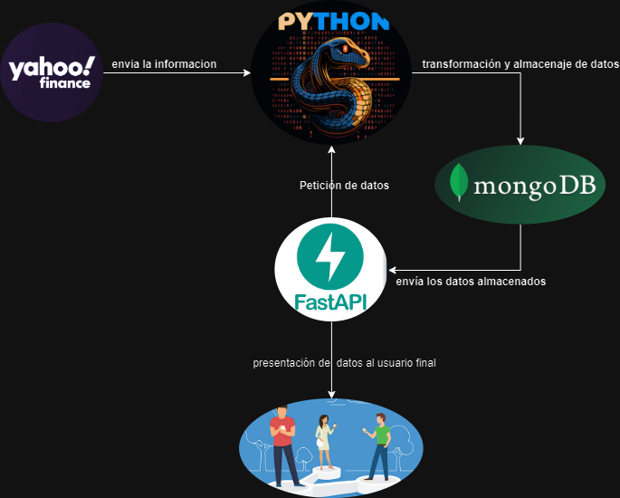

## Proyecto de FastApi   

<p align="center"></p>

- **Paso 1:**  Crear Carpeta del Proyecto. 
my_first_API
______________________________
- **Paso 2:**  Crea un entorno virtual.
  
>[!NOTE]
>En la terminal de Visual estudio Code:

Terminal>
``` 
python -m venv venv
```			
>("-m", se refiere a que se instalará módulo de python, "venv" nombre del entorno virtual, de la siglas Virtual Enviroment)
>
>"Notar que se crea una carpeta en el directorio en el que nos encontramos."
______________________________
- **Paso 3:**  Activar entorno virtual.

En Windows:

Terminal>
```
venv/Scripts/activate
```
>"Notar que en la línea de comando ahora aparece, previa a la ruta la palabre (venv) PS C:\Users\my_first_API>

En Linux:
``` 
source venv/bin/activate
 ```

_______________________________
- **Paso 4:**  Instalar FastAPI
Terminal>
```
 pip install fastapi
```
________________________________________________
- **Paso 5:**  Instalar el módulo de ejcución de FastAPI
Terminal>
```
 pip install uvicorn
```
_____________________________________________________________
- **Paso 6:**  Crar el archivo para crer el código para Ejecutar API.

main.py
_________________________________________________________
- **Paso 7:**  Dentro del arcchivo importar el módulo de FastAPI
 ```
from fastapi import FastAPI
```

___________________________________________________________
- **Paso 8:** Se crea una instancia de FastAPI.
```
 app = FastAPI()
```
_________________________________
- **Paso 9:** Crear el primer endpoint:
```
@app.get('/')
  def message():
      return "Hello-World"
```
_______________________________
- **Paso 10:** Para correr en la API:

Terminal>

```
uvicorn main:app --reload
```		
>(Por defecto la aplicación se abre en el puerto 8000, para cambiar el puerto se añade la Bandera --port 5000)

```
uvicorn main:app --reload --port 5000
```

```
uvicorn main:app --reload --port 5000 --host 0.0.0.0
```

>(Ya la app estaría accesible a la red, se accede desde cualquier dispositivo con la ipmaquina:5000)
______________________________
- **Paso 11:** Para salir de la API:
Terminal:
>Control + C
Terminal> deactivate

							PARTE 2 (Documentación Api)
							---------------------------
________________________________________________________
- **Paso 1:** Acceder a la documentación automátca con Swagger.
Con la API levantada, (Ver Parte 1, paso 10)

Navegador>
```
ipmaquina:5000/docs
```

>[!NOTe]
>"Notar que se accede a una interfaz web que permite ver y acceder a nuestro endpoint"
________________________________________________________________
- **Paso 2:** Modificar el título de la documentación.
Dirigirse al Script que crea la API > main.py
Justo debajo luego de crear la instancia de FastAPI()
```
app.title = "My First API"
```
_____________________________
- **Paso 3:** Modificar la versión. 
```
app.version = "Basic 0.0.1"
```
___________________________________________
- **Paso 4:** Modificar la etiqueta del endpoint.
```
@app.get('/', tags=['home')
```
>("tags=['home'] se refiere al nombre que queremos usar, se debe pasar en una lista)
____________________________________________________________
- **Paso 5:** Uso de docstring para explicar el uso de la función.
Se agrega después de declarar la función antes del código agregar la descripción de lo que hace la función.

```
 def message():
    """Devuelve el mensaje de 'Hello Word'"""
    return "Hello World!"
```
								PARTE 3
							---------------------------
## Agregar Fast API a nuestro proyecto.
<p align="center"></p>

### Buscamos hacer algo asi 
## Descripción

Este proyecto mejpraremos el proyecto anterior agregando un forma de visualizar los datos utiliza la biblioteca `fastapi` para poder generan una pagina con los datos financieros de varias empresas y los almacena en una base de datos MongoDB.

## Instalación

Para instalar las dependencias del proyecto, asegúrate de tener `yfinance`,`fastapi`,`pandas` y `pymongo` instalados en tu entorno Python. Puedes instalarlos utilizando pip:

```
pip install yfinance pandas pymongo fastapi uvicorn
```

## Uso
Para ejecutar el código, simplemente ejecuta el script main.py. Asegúrate de tener una instancia de MongoDB en ejecución y especifica la dirección IP y el puerto correctos en la variable client.

```
python main.py
```
Contribución
Si deseas contribuir al proyecto, puedes abrir issues para informar sobre problemas o sugerir mejoras. También puedes enviar pull requests con cambios propuestos.

Enlaces
- [Documentación de FastAPI](https://fastapi.tiangolo.com/) 

## Documentacion de las modificaciones al codigo previo

### 1. Importaciones de bibliotecas (ACTUALIZADO CON MAS LIBRERIAS)
```
# Importar las bibliotecas necesarias
import yfinance as yf  # Para obtener datos financieros
import pandas as pd  # Para manejar datos de forma tabular
from datetime import datetime  # Para manejar fechas
from pymongo import MongoClient  # Para conectarse a MongoDB

#NUEVO
# Importar las bibliotecas necesarias para FastAPI
from fastapi import FastAPI, HTTPException, Request
from fastapi.responses import HTMLResponse
from fastapi.param_functions import Path
```
### 2. Establecer la conexión a MongoDB (SIN CAMBIOS)

```
# Establecer la conexión a MongoDB
client = MongoClient('192.168.0.21', 27017)  # Conectarse a MongoDB en la dirección especificada y en el puerto 27017

```
### 3. Obtención de datos financieros de empresas y construcción de diccionarios (CAMBIOS MENORES)
```
# Definir una lista para almacenar los datos de las empresas
lista_de_empresas = []
# Definir una fecha específica para obtener los datos financieros
fecha = '2023-12-31'
# Lista de símbolos de empresas para obtener datos
tickers = ['TSLA', 'NFLX', 'META', 'AMZN', 'GOOG']

#NUEVO
# Inicializar un contador para asignar un ID único a cada empresa
i = 1

# Iterar sobre cada símbolo de empresa en la lista

for nombre_empresa in tickers:
    # Obtener datos financieros de la empresa usando yfinance
    empresa = yf.Ticker(nombre_empresa)
    info = empresa.info
    dato = empresa.financials

    # Obtener información sobre el CEO y su edad
    ceo_name = info.get("companyOfficers", [{}])[0].get("name", "No disponible")
    edad = info.get("companyOfficers", [{}])[1].get("age", "No disponible")

    #MODIFICADO PARA TENER ID 
    # Crear un diccionario con los datos deseados de la empresa
    empresa_datos = {
        "id": i,
        "Nombre de la empresa": info.get("longName", "No disponible"),
        "Sector": info.get("sector", "No disponible"),
        "CEO": ceo_name,
        "Edad del CEO": edad,
        "Volumen promedio": info.get("averageVolume", "No disponible"),
        "Tax Rate For Calcs": dato[fecha]["Tax Rate For Calcs"],
        "Reconciled Depreciation ": dato[fecha]["Reconciled Depreciation"],
        "EBITDA ": dato[fecha]["EBITDA"],
        "Interest Expense": dato[fecha]["Interest Expense"],
        "Gross Profit": dato[fecha]["Gross Profit"]
    }
    
    # Incrementar el contador
    i += 1
    
    # Agregar los datos de la empresa a la lista
    lista_de_empresas.append(empresa_datos)
```

### 4. Conexión y almacenamiento de datos en MongoDB (SIN CAMBIOS)
```
# Seleccionar una base de datos (o "crear" una nueva al insertar datos)
db = client['finance']  # Seleccionar o crear una base de datos llamada 'finance'

# Insertar documentos en una colección
collection = db['datos']  # Seleccionar o crear una colección llamada 'datos' dentro de la base de datos 'finance'
collection.insert_many(lista_de_empresas)  # Insertar los datos de las empresas en la colección 'datos'
```
### 5. Crear una instancia de FastAPI (NUEVO SE UTLIZA UN POCO HTML)

```
app = FastAPI()
app.title = "My First API"
app.version = "Basic 1.0.0"

# Ruta para la página de inicio
@app.get('/', tags=['home'])
def message():
    """Devuelve el mensaje de 'Hello Word' con un enlace a la lista de empresas"""
    return HTMLResponse('<h1>Hello World</h1><p><a href="/lista_de_empresas">Ver lista de empresas</a></p>')

# Ruta para mostrar la lista de empresas
@app.get("/lista_de_empresas", response_class=HTMLResponse)
async def read_items(request: Request):
    """Devuelve una página HTML con la lista de empresas y sus detalles"""
    items_html = ""
    for empresa in lista_de_empresas:
        items_html += f"<h2>Empresa {empresa['Nombre de la empresa']}, ID: {empresa['id']}</h2>"
        items_html += "<ul>"
        for key, value in empresa.items():
            items_html += f"<li><strong>{key}:</strong> {value}</li>"
        items_html += "</ul>"
    html_content = f"<html><head><title>Lista de Empresas</title></head><body><a href='/'>Volver a la página de inicio</a>{items_html}</body></html>"
    return HTMLResponse(content=html_content, status_code=200)

# Ruta para obtener los detalles de una empresa por su ID
@app.get('/lista_de_empresas/{id}', tags=['lista_de_empresas'], response_class=HTMLResponse)
def get_empresa_by_id(id: int = Path(..., title="ID de la empresa a buscar")):
    """Devuelve los detalles de una empresa por su ID"""
    for empresa in lista_de_empresas:
        if empresa["id"] == id:
            # Construir HTML para los detalles de la empresa
            html_content = f"""
            <html>
                <head>
                    <title>Detalles de la Empresa</title>
                </head>
                <body>
                    <h1>Detalles de la Empresa</h1>
                    <h2>Empresa {empresa['Nombre de la empresa']} (ID: {empresa['id']})</h2>
                    <ul>
                        <li><strong>Sector:</strong> {empresa['Sector']}</li>
                        <li><strong>CEO:</strong> {empresa['CEO']}</li>
                        <li><strong>Edad del CEO:</strong> {empresa['Edad del CEO']}</li>
                        <li><strong>Volumen promedio:</strong> {empresa['Volumen promedio']}</li>
                        <li><strong>Tax Rate For Calcs:</strong> {empresa['Tax Rate For Calcs']}</li>
                        <li><strong>Reconciled Depreciation:</strong> {empresa['Reconciled Depreciation ']}</li>
                        <li><strong>EBITDA:</strong> {empresa['EBITDA ']}</li>
                        <li><strong>Interest Expense:</strong> {empresa['Interest Expense']}</li>
                        <li><strong>Gross Profit:</strong> {empresa['Gross Profit']}</li>
                    </ul>
                    <p><a href="/lista_de_empresas">Volver a la lista de empresas</a></p>
                </body>
            </html>
            """
            return HTMLResponse(content=html_content, status_code=200)
    # Si no se encuentra la empresa, retornar un error 404
    raise HTTPException(status_code=404, detail="Empresa no encontrada")
```
### Resultado final 
<p align="center"></p>

								PARTE 4
							---------------------------

## Llevar Fast API a Docker y luego hacer deployment.

- **Paso 1:** Lo primero que vamos a hacer es crear un entorno virtual de python. 
``````
python -m venv env
``````
- **Paso 2:** Activar el entorno virtual de python
``````
.\env\Scripts\activate
``````
- **Paso 3:** Luego lo ideal instalar en linea de comando Fast API
``````
pip install yfinance pandas pymongo fastapi uvicorn
``````
- **Paso 4:** Crear una carpeta en la misma jerarquía, que la del entorno virtual de python. En este caso la llame "app"
``````
mkdir app
``````
- **Paso 5:** Ingresar a la carpeta creada
``````
cd app
``````
- **Paso 6:** Crear los archivos main.py(el del punto anterior) y __init__.py, agregale el código que le da vida a tu API, tus módulos, agrega los archivos et...

- **Paso 7:** Al finalizar tu application e instalar las dependencias, se debe guardar todos los módulos y versiones usadas en un archivo requirements.txt
``````
pip freeze > requirements.txt
``````
- **Paso 8:** Luego crea el archivo Dockerfile aquí un ejemplo basado en la documentación de FastAPI
``````
FROM python:3.9

WORKDIR /code

COPY ./requirements.txt /code/requirements.txt

RUN pip install --no-cache-dir --upgrade -r /code/requirements.txt

COPY ./app /code/app

CMD ["uvicorn", "app.main:app", "--host", "0.0.0.0", "--port", "80"]
``````
- **Paso 9:** Luego asegurate de tener corriendo docker para construir la imagen de tu aplicación.
>[!NOTE]
>Este paso se ejecuta en ubuntu server

``````
docker build -t myapp .
``````

>[!NOTE]
>Demora un poco en crearse la imagen.

- **Paso 10:** En este punto asegúrate de tener una cuenta en [Dockerhub](https://hub.docker.com/) con los datos de tu cuenta te toca inciar sesión desde la línea de comando usando. 
``````
docker login
``````
- **Paso 11:** Luego de ingresar debes indicar el nombre de tu imagen asociado a tu usuario.
``````
docker tag myapp usuario/myapp
``````
- **Paso 12:** El siguiente paso será cargar la imagen a tu repo de docker hub.
``````
docker push timcepeda/myapp
``````
- **Paso 13:** Finalizado este paso es momento de ir a [render](https://render.com/) para deployar tu imagen de forma rápida. 

- Crea una cuenta en render
- Le das en crear un nuevo servicio web, en este caso usamos la versión free. 
- Indicas que es desde una imagen existente
- agrega la ruta de tu imagen como pista, sería usuario/myapp:latest
- Espera mientras se realiza el deployment

Al finalizar te pasará la url desde dónde puedes acceder a tu API. El resultado de este ejemplo lo puedes consumir [aquí](https://myapp-latest-qdyi.onrender.com) 

[Anterior](./yahoo-finance-mongodb.md)
[Back to Main README](./README.md)

