<h2>Pre-requisitos 📋</h2>

En este proyecto se llevó a cabo en un entorno de desarrollo Windows. Se utilizó una máquina virtual alojada en VirtualBox con Ubuntu Server, debido a que Docker no es compatible directamente con Windows. En la máquina virtual se instaló Docker para la gestión de contenedores. Para establecer la conexión entre la máquina virtual y el sistema operativo original de Windows, se empleó PuTTY. Además, para simplificar la transferencia y gestión de archivos en Ubuntu, también se puede optar por utilizar WinSCP.Los links se proveen a continuacion

Paso 0.01 Descarga el virtual disk de Ubuntu Server desde el siguiente enlace: [Descargar Ubuntu Server](https://drive.google.com/file/d/1EsDIcfz-MVvPwOSmUb-x5FE612puBZnF/view) (2.15 gb)

<p>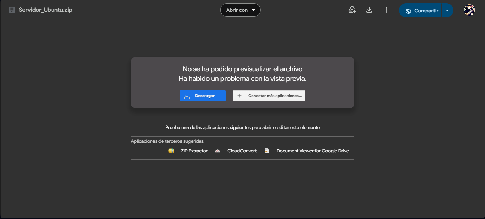</p>

Paso 0.02 Descarga e instala VirtualBox desde: [Descargar VirtualBox](https://www.virtualbox.org/wiki/Downloads)

<p>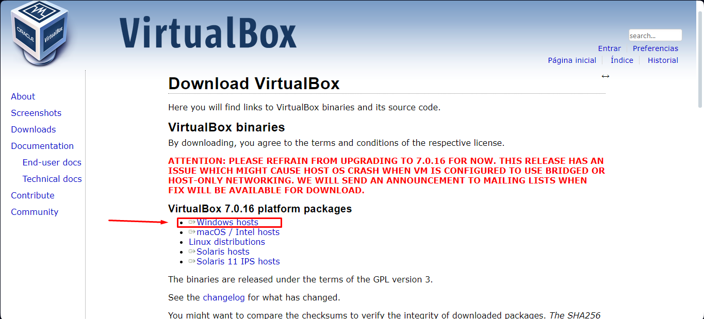</p>

Paso 0.03 Creamos una nueva maquina virtual

<p></p>

Paso 0.04 La llamamos ubuntu

<p>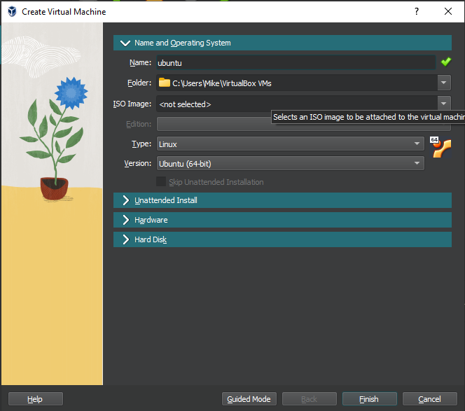</p>

Paso 0.05 Nos dirigimos a hard disk y ponemos utilizar un hard disk existente

<p>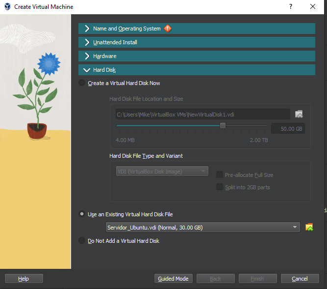</p>

Paso 0.06 Elegimos el hardisk anteriormente descargado y finalizar

<p>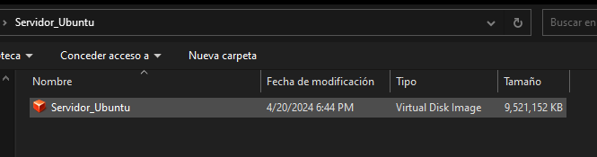</p>

Paso 0.07 Luego configuramos los puestos de red

<p></p>

Paso 0.08 En el primer adaptador pones adaptador puente y en avanzado permitir todo

<p></p>

Paso 0.09 En el segundo colocamos solo anfitrion y en avanzado permitir todo y guardamos 

<p>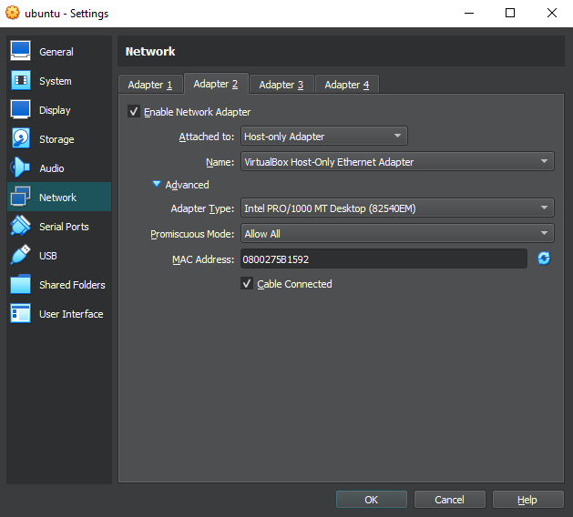</p>

Paso 0.10 Iniciamos la maquina virtual 

> [!CAUTION]
> Este paso fallara si se tiene la virtualizacion de windows desactivada .
> En este [video](https://www.youtube.com/watch?v=Tl4kODRGtIc&ab_channel=LuisOvalle)  explican como revisar si esta activa y en caso de no estarlo como activarlo 

<p>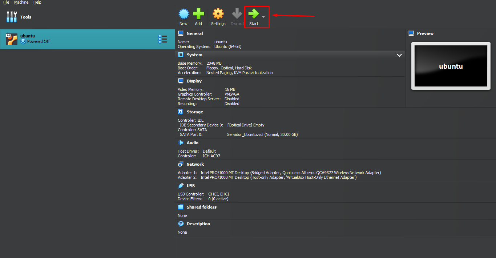</p>

Paso 0.11 esperamos un poco y ingresamos el usuario  y comtraseña  (por defecto viene ubuntu de usuario y ubuntu de contraseña)

<p>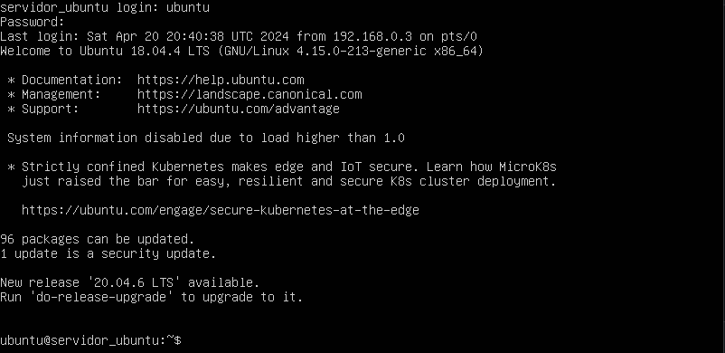</p>

Paso 0.12 A continuacion obtenemos el ip de la maquina virtual

```
hostname -I
```

<p>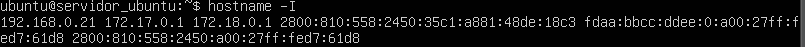</p>

Paso 0.13 Descargamos e instalamos el putty : [Descargar putty](https://www.putty.org/)

<p>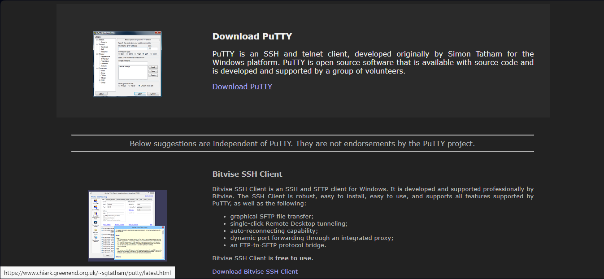</p>

Paso 0.14 Iniciamos el putty con la ip usuario y comtraseña de la maquina virtual

<p>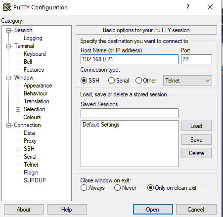</p>

Paso 0.15 Despues ingresamos el usuario y contraseña

<p>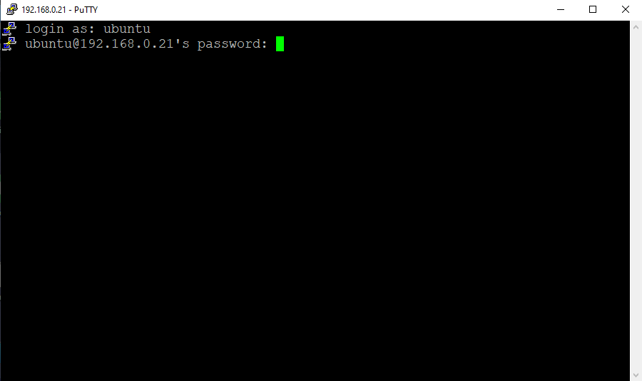</p>

Paso 0.16 Opcional descargar e instalar winscp : [Descargar winscp](https://winscp.net/eng/download.php)

<p>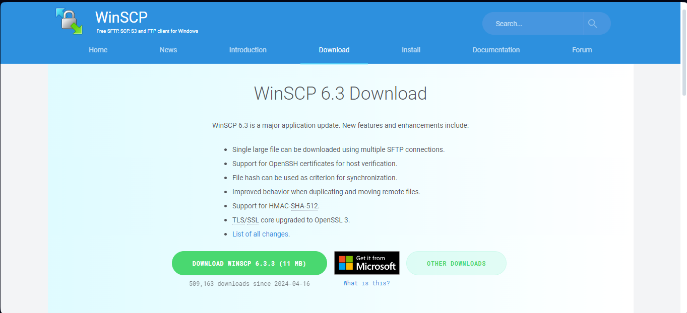</p>

Paso 0.17 Programa que nos permite editar y enviar archivos de una forma mas comoda se conecta igual que el putty con el ip de la maquina virtual

<p>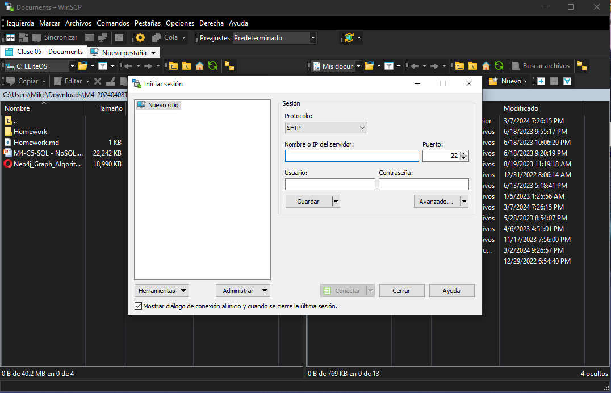</p>

<p align="right">(<a href="#readme-top">Volver al principio</a>)</p>
