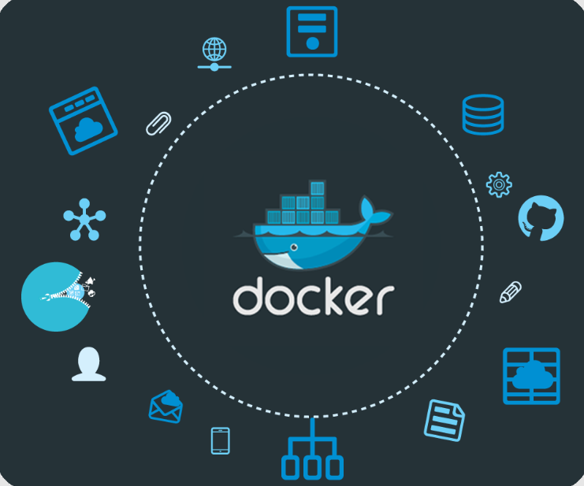

<h1> Almacenamiento de datos finacieros </h1>

## Guia paso a paso 📋

- [Pre-requisitos](./Pre-requisitos.md)
- [MongoDB](./MongoDB.md)
- [Yahoo-finance](./yahoo-finance-mongodb.md)
- [FastAPI](./FastAPI-Docker.md)

# Referencias

* 

## Desarrolladores

| [ Michael Martinez](https://github.com/bkmay1417) |
| :---: |

Copyright (c) 2024 [Michael Martinez] yam8991@gmail.com
