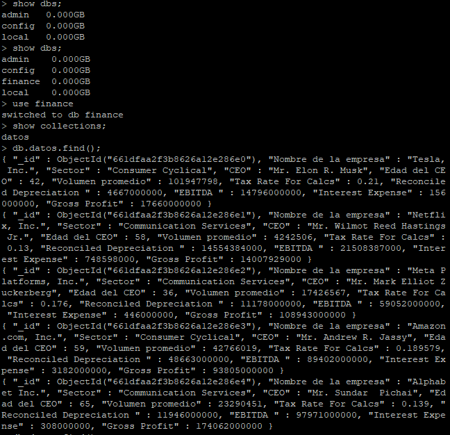

# Análisis Financiero con datos de Yahoo Finance 

<p align="center"></p>

## Descripción

Este proyecto utiliza la biblioteca `yfinance` para obtener datos financieros de varias empresas y los almacena en una base de datos MongoDB. Los datos recopilados incluyen información sobre empresas como el nombre, el sector, el CEO y datos financieros clave como el impuesto sobre la renta, la depreciación, el EBITDA, los gastos de interés y el beneficio bruto.

## Instalación

Para instalar las dependencias del proyecto, asegúrate de tener `yfinance`, `pandas` y `pymongo` instalados en tu entorno Python. Puedes instalarlos utilizando pip:

```
pip install yfinance pandas pymongo
```

## Uso
Para ejecutar el código, simplemente ejecuta el script main.py. Asegúrate de tener una instancia de MongoDB en ejecución y especifica la dirección IP y el puerto correctos en la variable client.

```
python main.py
```
Contribución
Si deseas contribuir al proyecto, puedes abrir issues para informar sobre problemas o sugerir mejoras. También puedes enviar pull requests con cambios propuestos.

Ejemplo de Resultado
python
```
[
    {
        "Nombre de la empresa": "Tesla, Inc.",
        "Sector": "Consumer Cyclical",
        "CEO": "Elon Reeve Musk",
        "Edad del CEO": 50,
        "Volumen promedio": 16528784,
        "Tax Rate For Calcs": 0.11,
        "Reconciled Depreciation ": 3172000000,
        "EBITDA ": 5375000000,
        "Interest Expense": 561000000,
        "Gross Profit": 6706000000
    },
    {
        "Nombre de la empresa": "Netflix, Inc.",
        "Sector": "Communication Services",
        "CEO": "Reed Hastings",
        "Edad del CEO": 61,
        "Volumen promedio": 4442937,
        "Tax Rate For Calcs": 0.218,
        "Reconciled Depreciation ": 373442498,
        "EBITDA ": 5399060058,
        "Interest Expense": 318158673,
        "Gross Profit": 17776718096
    },
    # Más datos de otras empresas...
]
```


Enlaces
- [Documentación de yfinance](https://pypi.org/project/yfinance/) 
- [Documentación de pymongo](https://pymongo.readthedocs.io/en/stable/)

## Documentacion del funcionamiento de este codigo 

### 1. Importaciones de bibliotecas
```
import yfinance as yf  # Para obtener datos financieros de empresas
import pandas as pd  # Para manejar datos en forma de DataFrame
from datetime import datetime  # Para trabajar con fechas y horas
import pymongo  # Para interactuar con MongoDB
from pymongo import MongoClient  # Para establecer la conexión con MongoDB
```
### 2. Establecer la conexión a MongoDB

```
# Establecer la conexión a MongoDB
client = MongoClient('192.168.0.21', 27017)  # Conectarse a MongoDB en la dirección especificada y en el puerto 27017

```
### 3. Obtención de datos financieros de empresas y construcción de diccionarios
```
# Definir una lista para almacenar los datos de las empresas
lista_de_empresas = []
# Definir una fecha específica para obtener los datos financieros
fecha = '2023-12-31'
# Lista de símbolos de empresas para obtener datos
tickers = ['TSLA', 'NFLX', 'META', 'AMZN', 'GOOG']

# Iterar sobre cada símbolo de empresa en la lista
for nombre_empresa in tickers:
    # Obtener datos financieros de la empresa usando yfinance
    empresa = yf.Ticker(nombre_empresa)
    info = empresa.info
    dato = empresa.financials
    # Obtener información sobre el CEO y su edad
    ceo_name = info.get("companyOfficers", [{}])[0].get("name", "No disponible")
    edad = info.get("companyOfficers", [{}])[1].get("age", "No disponible")
    # Crear un diccionario con los datos deseados de la empresa
    empresa_datos = {
        "Nombre de la empresa": info.get("longName", "No disponible"),
        "Sector": info.get("sector", "No disponible"),
        "CEO": ceo_name,
        "Edad del CEO": edad,
        "Volumen promedio": info.get("averageVolume", "No disponible"),
        "Tax Rate For Calcs": dato[fecha]["Tax Rate For Calcs"],
        "Reconciled Depreciation ": dato[fecha]["Reconciled Depreciation"],
        "EBITDA ": dato[fecha]["EBITDA"],
        "Interest Expense": dato[fecha]["Interest Expense"],
        "Gross Profit": dato[fecha]["Gross Profit"]
    }
    # Agregar el diccionario a la lista de empresas
    lista_de_empresas.append(empresa_datos)

# Imprimir la lista de empresas con sus datos financieros
print(lista_de_empresas)
```

### 4. Conexión y almacenamiento de datos en MongoDB
```
# Seleccionar una base de datos (o "crear" una nueva al insertar datos)
db = client['finance']  # Seleccionar o crear una base de datos llamada 'finance'

# Insertar documentos en una colección
collection = db['datos']  # Seleccionar o crear una colección llamada 'datos' dentro de la base de datos 'finance'
collection.insert_many(lista_de_empresas)  # Insertar los datos de las empresas en la colección 'datos'
```
### Resultado Mostrado en Mongodb

<p align="center"></p>

### Descripción general
Este script Python realiza las siguientes tareas:

- Importa las bibliotecas necesarias.
- Establece una conexión con una base de datos MongoDB.
- Obtiene datos financieros de empresas específicas utilizando la biblioteca yfinance.
- Construye diccionarios con información relevante de las empresas.
- Imprime la lista de empresas con sus datos financieros.
- Almacena los datos en una colección de una base de datos MongoDB

[Anterior](./MongoDB.md)
[Siguiente](./FastAPI-Docker.md)
[Back to Main README](./README.md)

